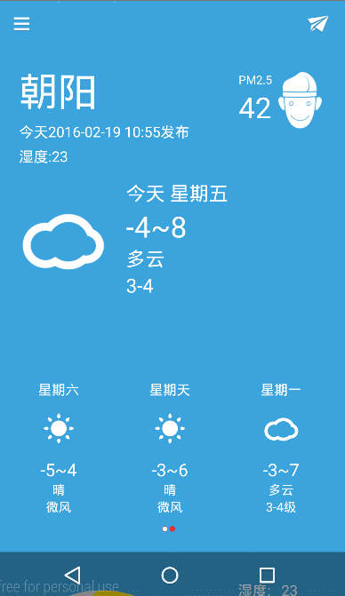

# WuKong-Weather-App（悟空天气）
Version2.0版本
悟空天气APP采用权威数据源授权信息，不仅拥有众多城市的天气预报和实时天气预警信息； 还可查看大城市的空气质量情况。

特色功能： 

1.**简约** 

2.**精确预报6天天气** 

3.**查询空气质量** 

4.采用**Matrial Design**风格的侧滑菜单，及support v7包中的控件 

 
 **代码中的UML如下**

##所使用的第三方库
1.**com.mikepenz:materialdrawer 一个符合material design规范的抽屉式菜单栏** 

2.**com.android.support:design  可以使用snackbar代替toast更好的显示效果** 

3.**com.android.volley  谷歌推出的访问网络的库** 

3.**百度定位  可以定位自己所在位置，该应用默认关闭gps** 

4.**自己编写的自定义View**----圆形进度条，来表示Pm2.5的值 
 
  
  
adapter—存放菜单城市列表，城市数据库，Fragment的包。 

重点内容 2. App—存放自定义Appliation。 

bean—存放Item，如City，Pm2.5信息，简单天气状况，详细天气状况，及天气预报。 

db—-使用SQLiteOpenHelper及SQLiteDatabase类的包。 

Fragment—各种用到的Fragment。 

fragmentViewPager—-滑动式5天天气预报，较好的操作效果。 

indicator—-fragment工具类。 

support—–工具类 

ui—-下拉刷新包 

util—-工具类 

weather—–主activity包。

欢迎各位随时与我交流：邮箱---460093533@qq.com
悟空天气项目的详细介绍地址：[CSDN博客](http://blog.csdn.net/zzzhangzhun/)，喜欢的朋友点下star吧。
